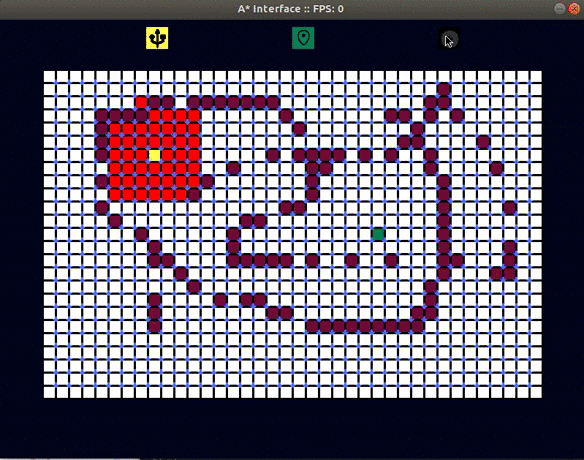

# _Visualizing_paths

### This project is a seemingly basic and elegent  *GUI*  implementation of _A* Algorithm_ (Shortest path algorithm)

#### 1 [Shortest Path Algorithm](#shortest-path-algorithm)
#### 2 [Using This Project](#using-this-project)
#### 3 [Run it on Your Computer](#run-it-on-your-computer)

- [main code](main.py)
## Shortest Path Algorithm::

This algorithm works like a *ripple* in water. It starts with the source and iterates over all blocks in all direction and
keeps track of value associated to each path.

We simply go to path in each direction till we stumble upon the destination and choose the shortest of it.

## Using This Project::

1 Select source icon  
 then Select source on grid

3 Select destination icon   
 then Select destination on grid

4 Drag and select the *to-be-blocked* tiles

5 Then Select play icon 

## Run it on Your Computer::

1 Download this repository by directly clicking **download** button under **clone or download**
  copy url and download using command **git clone url**
  
2 Open cmd in Windows or Terminal in Linux then **cd** your way into the directory where you have
  downloaded this project.
  
3 run using command
>**python3 main.py**
